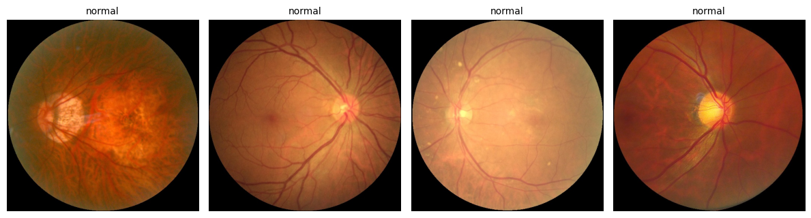
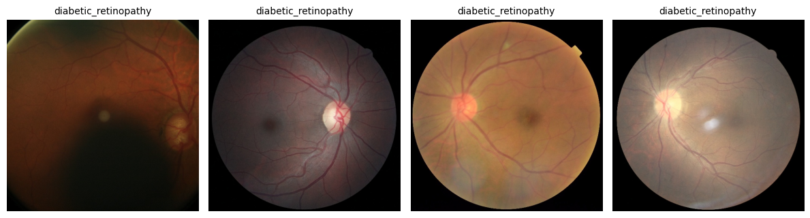
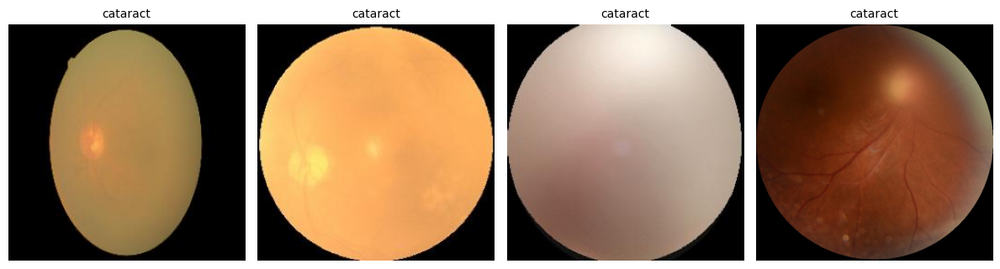
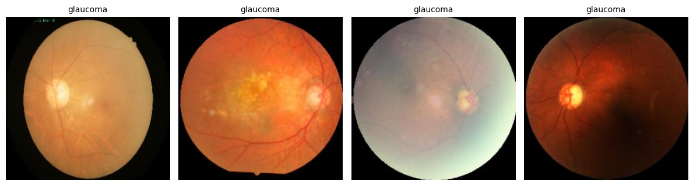
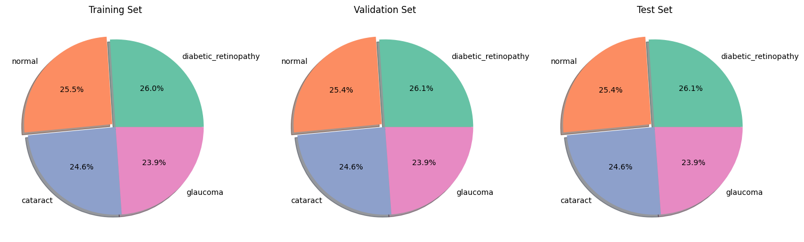
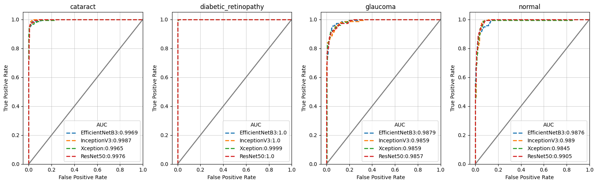
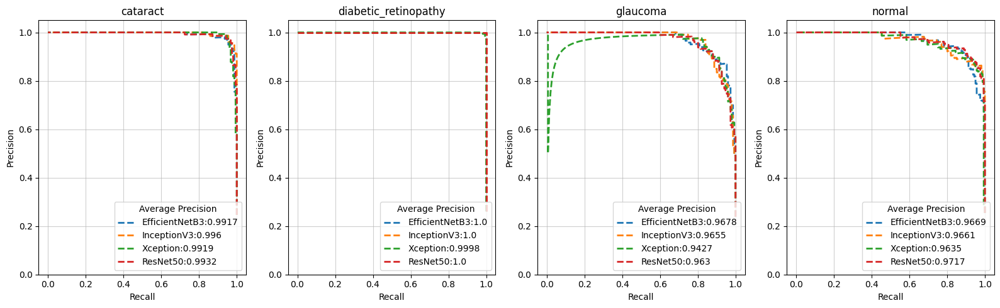
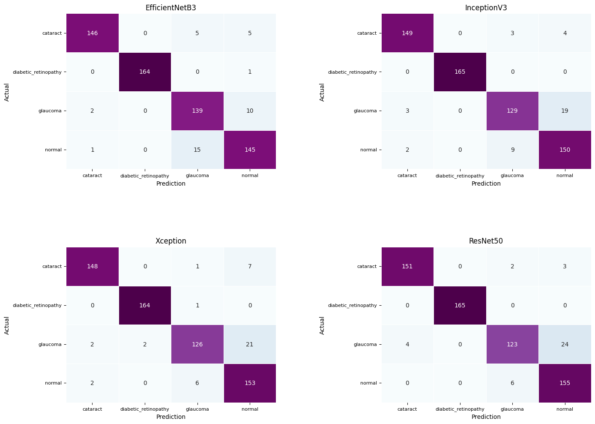

## Detection of Ocular Disorders with Deep Learning Based on Fundus Images

### Background

  Ocular disorders constitute a significant global health issue, affecting millions and imposing substantial economic burdens. 
  The World Health Organization (WHO) estimates that at least 2.2 billion people worldwide experience some form of near or distance vision impairment, with 1 billion of these cases being preventable or yet to be addressed. 
  The primary conditions contributing to distance vision impairment and blindness include cataracts (94 million cases), uncorrected refractive error (88.4 million), age-related macular degeneration (8 million), glaucoma (7.7 million), 
  and diabetic retinopathy (3.9 million)1. Without proper management, these disorders can progress to blindness. 
  Many ocular disorders are asymptomatic in their early stages, making diagnosis challenging and heavily reliant on the expertise of experienced ophthalmologists. 
  This situation underscores the urgent need for advanced imaging technologies and robust analytical techniques to facilitate timely intervention.
  
  Cataracts refer to the clouding of the natural lens of the eye, primarily associated with aging. 
  However, certain populations, such as individuals with diabetes or those on long-term steroid therapy, may experience cataracts earlier in life2. 
  In Singapore, approximately 78.6% of elderly patients are affected by cataracts, with prevalence increasing significantly with age: 63.6% among those aged 60 to 64 years and 94.6% among individuals aged 75 years and older2.
  
  Glaucoma is characterized by damage to the optic nerve, resulting in progressive vision loss. 
  In Singapore, around 10% of the population is affected by glaucoma, with up to 50% of these cases remaining undiagnosed3. 
  Globally, approximately 35.4% of individuals with diabetes develop diabetic retinopathy (DR), with about one-third of these cases advancing to vision-threatening stages4. 
  In Singapore, diabetes is an increasing public health concern, affecting roughly 1 in 12 people between 18 and 69 years of age—over 400,000 individuals in total5. 
  Diabetic retinopathy is the most prevalent microvascular complication of diabetes, emphasizing the urgent need for effective screening and management. 
  Prevalence rates for DR and vision-threatening DR in Singapore are particularly high compared to other Asian countries, at 33.9% and 8.9%, respectively4.
  
  The economic impact of visual impairment is profound, with an estimated annual productivity loss of about $411 billion globally1. 
  The integration of deep learning (DL) techniques in medical imaging has transformed diagnosis and disease management. 
  Deep learning algorithms have shown promise in diagnosing major eye disorders, including diabetic retinopathy, cataracts, glaucoma, and age-related macular degeneration6,7,8. 
  These algorithms can analyze vast amounts of imaging data to identify patterns indicative of disease progression, thereby supporting ophthalmologists in making informed decisions.

### Objective

  To develop an algorithm that accurately distinguishes diabetic retinopathy, glaucoma, and cataracts from normal eye images using a deep learning approach. 
  By utilizing fundus images, the model will be trained to identify specific features associated with each eye disorder, facilitating early detection and intervention. 
  The objective is to create a robust classification system that not only improves diagnostic efficiency but also supports ophthalmologists in clinical decision-making, ultimately contributing to better patient outcomes in ocular health.

### Potential Use Cases

  The trained classifier holds significant potential for automating large-scale population screening for eye disorders that may lead to vision impairment, including diabetic retinopathy, glaucoma, and cataracts. 
  By streamlining the screening process, the model could reduce costs and save time, allowing healthcare resources to be concentrated on individuals diagnosed with these conditions. 
  This focus enables earlier interventions to mitigate the risk of vision loss. 
  
  Furthermore, integrating the trained classifier into telemedicine platforms could facilitate remote and accessible screening for these eye diseases. 
  Such integration would allow patients in underserved or rural areas to receive preliminary assessments without the need for in-person visits, supporting early detection and timely referrals. 
  This system would not only expand reach and convenience but also optimize healthcare resources by prioritizing in-person consultations for high-risk individuals, thereby reducing costs and time associated with initial screenings. 
  Ultimately, this approach promotes a proactive healthcare model, helping to prevent the progression of these conditions to severe vision impairment.

### The Dataset

  The dataset used in this project is an open-source collection obtained from Kaggle, consisting of a total of 4,217 fundus images categorized into four classes: diabetic retinopathy, glaucoma, cataract, and normal. 
  The distribution includes 1,098 images of diabetic retinopathy, 1,007 images of glaucoma, 1,038 images of cataract, and 1,074 normal retina images. 
  The dataset was divided into training, validation, and test sets in a 0.7:0.15:0.15 ratio, yielding 2,951 images for training, and 633 images each for validation and testing. 
  To ensure balanced representation, a stratified split was applied, maintaining an equal proportion of images from each class across the subsets. 
  Used data is available at the following link and can be accessed for free (https://www.kaggle.com/datasets/gunavenkatdoddi/eye-diseases-classification/data).

  
  <i>Figure 1. Proportion of each image class in train, validation, and test datasets.</i>

### Data Preprocessing

  All images were rescaled to a pixel intensity range of 0 to 1 to normalize the input data. 
  To enhance the diversity of the training dataset and prevent overfitting, data augmentation techniques were applied. 
  The augmentation strategies included random rotations up to 0.3 radians, width and height shifts of up to 10%, zoom adjustments within a 0.1 range, as well as horizontal and vertical flips. 
  These techniques were implemented to improve the model’s ability to generalize across variations in the input data.

### Model Architecture

  In this project, the Convolutional Neural Network (CNN) was developed to classify fundus images into four categories: cataract, glaucoma, diabetic retinopathy, and normal eyes. 
  To enhance the training process, we utilized transfer learning techniques with multiple pre-trained models, including EfficientNetB3, InceptionV3, Xception, and ResNet50. 
  These models were selected for their proven efficacy in image classification tasks.
  The model architecture was defined using the following specifications:

  1. Input Shape: The input shape for the images was standardized to (224, 224, 3) to ensure consistency across all data fed into the network.
  2. Base Model: Each of the selected pre-trained models was initialized without their top layers (`include_top=False`) and loaded with weights pre-trained on the ‘ImageNet’ dataset. This approach allows the models to leverage learned features from a large dataset, which is particularly beneficial for our classification task.
  3. Trainable Layers: The layers of each base model were set to be trainable, enabling the network to adapt specifically to our dataset during training.
  4. Model Architecture:
     - The output from each base model was processed through a Rescaling layer to normalize pixel values between 0 and 1.
     - A Batch Normalization layer was then applied to stabilize and accelerate training by normalizing activations.
     - Following this, a Global Average Pooling layer was used to reduce dimensionality while retaining essential spatial information.
     - Two Dense layers were added with 256 and 128 units, respectively, both utilizing ReLU activation functions to introduce non-linearity.
     - To prevent overfitting, a Dropout layer with a rate of 0.2 was included.
     - The final output layer consisted of 4 units with a softmax activation function, enabling the classification of images into the specified categories.
  5. Model Compilation: Each model was compiled using the Adamax optimizer with a learning rate of 0.001, categorical cross-entropy as the loss function, and accuracy as the evaluation metric.
     - EarlyStopping: This callback monitors validation loss and stops training if no improvement is observed for 5 epochs while restoring the best weights.
     - ModelCheckpoint: This saves the best model during training based on validation loss.
     - CSVLogger: This logs training history for later analysis.
     - ReduceLROnPlateau: This adjusts the learning rate when validation loss plateaus, reducing it by a factor of 0.2 if no improvement is seen over 3 epochs.

### Results

  The accuracy of the four models—EfficientNetB3 (93.84%), ResNet50 (93.84%), Xception (93.68%), and InceptionV3 (93.36%) - showed no substantial differences on the test dataset. 
  However, when analyzing the accuracy for each individual class, all models demonstrated the highest performance in identifying diabetic retinopathy, 
  with both InceptionV3 and ResNet50 achieving 100% accuracy in distinguishing diabetic retinopathy images from other disorders. 
  In terms of cataract detection, all models achieved over 93% accuracy, with ResNet50 leading at 96.79%, followed by InceptionV3 at 95.51%, Xception at 94.87%, and EfficientNetB3 at 93.59%. 
  Furthermore, all models successfully identified normal eye images with an accuracy greater than 90% [ResNet50 (96.27%), Xception (95.03%), InceptionV3 (93.17%), EfficientNetB3 (90.06%)] when distinguishing them from eye disorders. 
  However, the models exhibited varying performance in identifying glaucoma. 
  Except for EfficientNetB3 (92.05%), the other three models—ResNet50, Xception, and InceptionV3—achieved accuracies ranging from 81.46% to 85.43% in distinguishing glaucoma from normal eyes and other eye disorders. 
  This highlights a notable area for improvement in glaucoma detection across these models.

#### Accuracy
  <i>Table 1. Models accuracy.</i>
|                      |   EfficientNetB3 |   InceptionV3 |   Xception |   ResNet50 |
|:---------------------|-----------------:|--------------:|-----------:|-----------:|
| Cataract             |           0.9359 |        0.9551 |     0.9487 |     0.9679 |
| Diabetic Retinopathy |           0.9939 |        1.0000 |     0.9939 |     1.0000 |
| Glaucoma             |           0.9205 |        0.8543 |     0.8344 |     0.8146 |
| Normal               |           0.9006 |        0.9317 |     0.9503 |     0.9627 |
| Overall Accuracy     |           0.9384 |        0.9368 |     0.9336 |     0.9384 |

  
  <i>Figure 2. Receiver Operating Characteristic (ROC) Curves.</i>

#### Receiver Operating Characteristic Area Under the Curve
  <i>Table 2. AUC values.</i>
  |                      |   EfficientNetB3 |   InceptionV3 |   Xception |   ResNet50 |
  |:---------------------|-----------------:|--------------:|-----------:|-----------:|
  | Cataract             |           0.9969 |        0.9987 |     0.9965 |     0.9976 |
  | Diabetic Retinopathy |           1.0000 |        1.0000 |     0.9999 |     1.0000 |
  | Glaucoma             |           0.9879 |        0.9859 |     0.9859 |     0.9857 |
  | Normal               |           0.9876 |        0.989  |     0.9845 |     0.9905 |

#### Precision Recall Curve  
  
  <i>Figure 3. Precision Recall Curves.</i>
  
  <i>Table 3. Average precision values.</i>
  |                      |   EfficientNetB3 |   InceptionV3 |   Xception |   ResNet50 |
  |:---------------------|-----------------:|--------------:|-----------:|-----------:|
  | Cataract             |           0.9917 |        0.996  |     0.9919 |     0.9932 |
  | Diabetic Retinopathy |           1.0000 |        1.0000 |     0.9998 |     1.0000 |
  | Glaucoma             |           0.9678 |        0.9655 |     0.9427 |     0.963  |
  | Normal               |           0.9669 |        0.9661 |     0.9635 |     0.9717 |

  <i>Table 4. Precision, recall, and F1 score.</i>
  | Image Class          | Metrics   |   EfficientNetB3 |   InceptionV3 |   ResNet50 |   Xception |
  |:---------------------|:----------|-----------------:|--------------:|-----------:|-----------:|
  | Cataract             | Precision |           0.9799 |        0.9675 |     0.9742 |     0.9737 |
  |                      | Recall    |           0.9359 |        0.9551 |     0.9679 |     0.9487 |
  |                      | F1 Score  |           0.9574 |        0.9613 |     0.9711 |     0.9610 |
  | Diabetic retinopathy | Precision |           1.0000 |        1.0000 |     1.0000 |     0.9880 |
  |                      | Recall    |           0.9939 |        1.0000 |     1.0000 |     0.9939 |
  |                      | F1 Score  |           0.9970 |        1.0000 |     1.0000 |     0.9909 |
  | Glaucoma             | Precision |           0.8742 |        0.9149 |     0.9389 |     0.9403 |
  |                      | Recall    |           0.9205 |        0.8543 |     0.8146 |     0.8344 |
  |                      | F1 Score  |           0.8968 |        0.8836 |     0.8723 |     0.8842 |
  | Normal               | Precision |           0.9006 |        0.8671 |     0.8516 |     0.8453 |
  |                      | Recall    |           0.9006 |        0.9317 |     0.9627 |     0.9503 |
  |                      | F1 Score  |           0.9006 |        0.8982 |     0.9038 |     0.8947 |

#### Confusion Matrix
  

### References

1. [Blindness and vision impairment – World Health Organization (WHO).](https://www.who.int/news-room/fact-sheets/detail/blindness-and-visual-impairment)
2. [Cataract – National University of Hospital (NUH).](https://www.nuh.com.sg/care-at-nuh/outcome-of-our-care/cataract#:~:text=In%20Singapore%2C%20the%20percentage%20of,people%2075%20years%20and%20older)
3. [Glaucoma: Eye Under Pressure – Singapore National Eye Centre.](https://www.snec.com.sg/singvision-issue1-2022-glaucoma-eye-under-pressure#:~:text=In%20Singapore%2C%20glaucoma%20affects%20approximately,may%20not%20have%20any%20symptoms)
4. Neelam K, Aung KCY, Ang K, Tavintharan S, Sum CF, Lim SC. Association of Triglyceride Glucose Index with Prevalence and Incidence of Diabetic Retinopathy in a Singaporean Population. Clin Ophthalmol. 2023;17:445-454
5. [Diabetic Retinopathy: Updates in Detection and Treatment - Singapore National Eye Centre, SingHealth.](https://www.singhealth.com.sg/news/medical-news/updates-in-detection-and-treatment-of-diabetic-retinopathy)
6. Ting, D. S. W., Cheung, C. Y., Lim, G., Tan, G. S. W., Quang, N. D., Gan, A., Hamzah, H., Garcia-Franco, R., San Yeo, I. Y., Lee, S. Y., Wong, E. Y. M., Sabanayagam, C., Baskaran, M., Ibrahim, F., Tan, N. C., Finkelstein, E. A., Lamoureux, E. L., Wong, I. Y., Bressler, N. M., Sivaprasad, S., … Wong, T. Y. (2017). Development and Validation of a Deep Learning System for Diabetic Retinopathy and Related Eye Diseases Using Retinal Images From Multiethnic Populations With Diabetes. JAMA, 318(22), 2211–2223.
7. Sarki, R., Ahmed, K., Wang, H., & Zhang, Y. (2020). Automated detection of mild and multi-class diabetic eye diseases using deep learning. Health information science and systems, 8(1), 32.
8. K. Prasad, P. S. Sajith, M. Neema, L. Madhu and P. N. Priya, "Multiple eye disease detection using Deep Neural Network," TENCON 2019 - 2019 IEEE Region 10 Conference (TENCON), Kochi, India, 2019, pp. 2148-2153.

